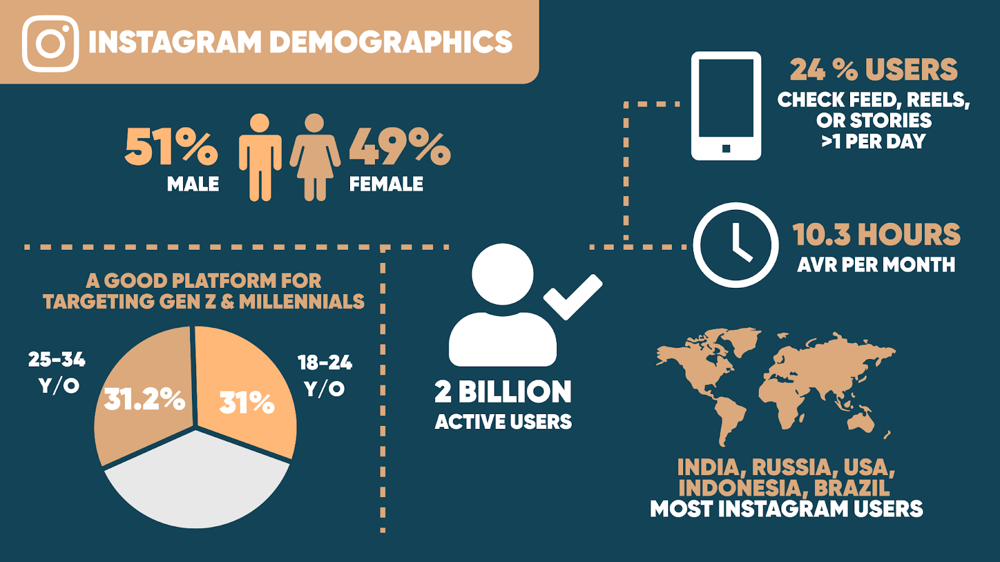
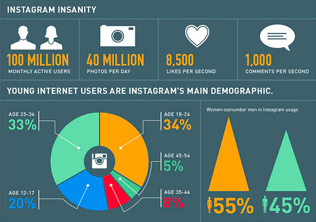

### Name 
**Anushika Kothari** 🧑‍🎓
### USN
**01FE21BCS062**🏫

### Course Name
**Arithmetic Program Solving** 📊

### Course Code
**23ECSE309** 🔢

### Course Teacher
**Prof. Prakash Hegade** 👨‍🏫

### University
**KLE Technological University, Hubballi-31** 🏛️

### Portfolio Domain
**Instagram** 📸

----

## 🌟 Introduction

Welcome to my portfolio, where I delve into arithmetic problem-solving within Instagram 🌟. As one of the largest social media platforms globally, Instagram's dynamic environment, rich with diverse user interactions and algorithmic recommendations, offers a unique landscape for innovative problem-solving using dynamic programming 🛠️. By leveraging existing literature and focusing on Instagram's specific challenges, I aim to contribute novel solutions that enhance user experiences and optimize the platform's ecosystem 🚀. With billions of active users worldwide, Instagram's significance is undeniable, and this portfolio showcases my dedication to applying strategic data structures and algorithms to real-world issues, bridging the gap between theory and practice 📚.
### **Instagram Market Analysis 📈📊**

---

Instagram, launched in 2010 and acquired by Facebook in 2012, has grown into one of the leading social media platforms globally. Boasting over **2 billion active users** 🌍, Instagram has established itself as a significant player in the social media market. Its visual-centric approach allows users to share photos 📸 and videos 🎥, engage with stories 📖, and explore content through various features such as IGTV and Reels.

Instagram's high user engagement rates 📈 and sophisticated ad targeting capabilities 🎯 make it a powerful platform for advertisers. A significant 24% of users check their feed, reels, or stories more than once per day, spending an average of 10.3 hours per month on the platform. Businesses leverage Instagram to reach diverse audiences 👥, promote products 🛍️, and build brand loyalty. Its emphasis on visual content is particularly effective for industries like fashion 👗, beauty 💄, travel ✈️, and lifestyle 🏖️. 

The platform's seamless integration with e-commerce 🛒 has opened new revenue streams. Features like shoppable posts and in-app checkout 🛍️ enable users to purchase products directly from the app, enhancing the shopping experience and driving sales for brands. Influencers also play a critical role on Instagram, promoting products and engaging with followers, further driving the platform's commercial success.

User demographics show a fairly balanced gender distribution with 51% male and 49% female users. The age distribution is also noteworthy: 31% of users are aged 18-24, while 31.2% are aged 25-34. This makes Instagram particularly effective for targeting Generation Z and Millennials, who are key consumer groups for many brands.

Globally, Instagram's user base includes major markets such as India, Russia, the USA, Indonesia, and Brazil. This extensive reach highlights Instagram's influence across different regions and cultures, making it a critical platform for international marketing campaigns.

User engagement on Instagram is exceptionally high. The platform sees **40 million photos** uploaded daily, **8,500 likes per second** ❤️, and **1,000 comments per second** 💬, indicating active participation from users and a vibrant community. The monthly active users reach **100 million**, emphasizing its consistent popularity and relevance.

Instagram continually adapts to market trends, such as the rise of short-form video content 📹. Features like Reels, which compete with TikTok, showcase Instagram's ability to innovate and stay relevant in the fast-evolving social media landscape. Its robust analytics tools 📊 provide businesses with insights into their audience and campaign performance, ensuring that marketing strategies are data-driven and effective.

In summary, Instagram's dynamic features, high engagement rates, and strong e-commerce integration solidify its position as a crucial platform for both social interaction and business marketing. The platform's ability to attract and engage a diverse audience, along with its innovative approach to content and advertising, makes it indispensable in the competitive social media ecosystem. 📈

---

## **Objectives**
* To propose advanced algorithms and data structures to improve Instagram's performance 📈💡.

* To apply DSA and APS concepts for real-world design and efficiency improvements on Instagram 🛠️🚀.

* To enhance user experience and engagement through innovative algorithmic proposals for Instagram 🌟📊.

---

## 📊 Existing Services Provided by Instagram

---

## 💡 Design Challenges & Solutions 

---

### 1. Posts Categorization Based on Hashtags 🔖

**Challenges and Market Benefits**:
Categorizing posts based on hashtags on platforms like Instagram enhances content discoverability and improves user engagement. However, the challenges include handling vast amounts of user-generated content, ensuring accurate categorization to provide relevant recommendations, and adapting to the dynamic nature of trending hashtags. 📈💬

**Time & Space Complexity for LCS ⏳**

Time Complexity: (O(m*n)), where m and n are lengths of sequences.
Space Complexity: (O(m*n)) for storing the LCS table.

*Code for sample implementation of [Longest Common Subsequence](all_codes/Longest-Common-Subsequence.cpp)*

**Time & Space Complexity for Radix Tree 🕒** 

Time Complexity: For insertion, deletion and search: O(l) l is length of the tag.

Space Complexity: O(n*l) where n is number of strings and l is average length of the strings.

*Code for sample implementation of [Radix Tree](https://github.com/Anushika0304/radix-tree/blob/master/radix_tree.cpp)*

---

### 2. Hashtag Suggestions Using Edit Distance 🔖

**Challenges and Market Benefits**:
Ensuring accuracy and relevance in hashtag suggestions is critical. The system must process user input in real-time without noticeable delays 🕒, handle a large and growing database of hashtags efficiently, and support multiple languages and slang 🌐. Additionally, it needs to dynamically update the database with new trends while maintaining performance 📈.

**Design Technique**:
Maintain a database of popular hashtags using a trie 🌳 or BK-tree for efficient management. When a user types a hashtag, calculate the edit distance between the input and stored hashtags to find the closest matches. Suggest hashtags with the smallest edit distances, using approximate string matching 🔍 and parallel processing to optimize performance.

**Time & Space Complexity 🕒**
* Time Complexity: O(L) for insertion, deletion, and lookup operations, where L is the length of the key (typically a word)
  
* Space Complexity: O(ALPHABET_SIZE * L) where ALPHABET_SIZE is the number of possible characters and L is the length of the key

*Code for sample implementation of [Edit Distance](all_codes/edit.cpp)*

*Code for sample implementation of [Trie](all_codes/trie.cpp)*

---

### 3. Real-Time Analytics and Insights 📊
**Challenges and Market Benefits:**
Efficiently managing and querying large datasets in real-time poses significant challenges for Instagram 🌐. The platform must handle vast amounts of data generated by user interactions, including likes 👍, comments 💬, shares 🔄, and hashtag usage #️⃣. Ensuring low latency ⏳ and high accuracy 🎯 in analytics is critical to provide timely insights. The market benefits include improved user engagement 😊, personalized content delivery 📲, and enhanced advertising strategies based on accurate and up-to-date analytics 📈.

**Design Technique**
Employing segment trees 🌳 for efficient real-time analytics. Each node in the segment tree represents aggregated metrics (e.g., sum, max, min) over data points. Leaf nodes 🍃 store individual user interactions, while internal nodes maintain aggregated values. Updates propagate from leaf to root, ensuring accuracy for range queries 🔍 and updates.

**Time and Space Complexity 🕒:**
Time Complexity 

* Construction: O(n) for tree setup from data points.
  
* Queries: O(log n) for efficient metric retrieval.
  
* Updates: O(log n) for propagating changes.
  
Space Complexity : O(n) for node storage, manageable with proper resource allocation.

*Code for sample implementation of [Segment Tree](all_codes/segment.cpp)*

### 4. Personalized Content Recommendations 🔍✨
**Challenges and Market Benefits:**
Personalizing content on Instagram involves navigating a vast network of user interests and interactions 🌐. The challenge is to efficiently find relevant content in real-time ⏱️. Instagram must analyze numerous data points, such as likes 👍, comments 💬, shares 🔄, and browsing history 📜, to deliver personalized recommendations. Effective personalization boosts user engagement and satisfaction 📈 by showing users content they are more likely to interact with, leading to longer session times and increased loyalty. Additionally, personalized content delivery enhances advertising strategies 🎯 by targeting users with ads that match their interests, thereby improving conversion rates.

**Design Technique:**
A* search ⭐ can be employed to find the shortest path to relevant content. In this approach, users and content items are represented as nodes in a graph, with edges symbolizing preferences and interactions 🔗. The A* algorithm uses a heuristic to estimate the shortest path from the current node to the target node, prioritizing paths that are likely to lead to the most relevant content. By efficiently navigating through the graph, A* search recommends content that closely matches user interests, enhancing the personalization process. This method ensures that users receive timely and accurate content suggestions, improving their overall experience on the platform 😊.

**Time and Space Complexity 🕒:**

* Time Complexity: O(b^d) 🌐

* Space Complexity: O(b^d) 📊 , where **b** is branching factor and **d** is depth of the solution 

*Code for sample implementation of [A* algorithm](https://github.com/daancode/a-star)*

### 5. Ad Placement Optimization on Instagram 📏
**Challenges and Market Benefits:**
Instagram faces challenges in optimizing ad placements, much like the Rod Cutting Problem, by balancing optimal ad durations for user engagement without overwhelming users. This involves analyzing user interaction patterns to adjust ad lengths effectively. Balancing revenue goals with a positive user experience is critical, ensuring ads are relevant and non-intrusive to enhance user satisfaction. By strategically optimizing ad placements, Instagram can maximize revenue and improve user engagement, fostering higher retention rates and loyalty among users.🕒📈

**Design Technique:**
The Rod Cutting Problem can be analogously applied to optimize ad placements on Instagram. Just as the rod cutting problem seeks to maximize the profit from cutting a rod into pieces of various lengths, Instagram can maximize revenue by determining the best placement and duration for ads based on user behavior and engagement metrics. 📏💼

**Time & Space Complexity 🕒:**
* Time Complexity: O(n^2) using dynamic programming, where n is the number of different ad placement lengths.

* Space Complexity: O(n), where n is the number of different ad placement lengths.🧮

*Code for sample implementation of [Rod Cutting Problem](all_codes/rod.cpp)*

---
### 6. Efficient managing and retrieving of user timelines🕒

**Challenges & Market Benefits**:
Implementing skip lists in Instagram for managing user timelines or feeds presents challenges in terms of space complexity, implementation intricacies, and performance optimization. However, skip lists offer significant benefits such as efficient access with logarithmic time complexity for operations, scalability to handle large-scale data dynamically, and improved user experience through faster content delivery and enhanced engagement on the platform.📊🚀 

**Design Technique:**
Implementing skip lists involves maintaining multiple layers of linked lists with probabilistic skipping, which speeds up search operations. Each level acts as an express lane, reducing the average time complexity for search operations.🛤️

**Time & Space Complexity ⏳:** 
* Time Complexity : Skip lists offer efficient average-case time complexities for search, insertion, and deletion operations, all being O(log n), where **n** is the number of elements in the list.

* Space Complexity : The space complexity of skip lists is O(n).

*Code for sample implementation of [Skip List](all_codes/skip.cpp)*

---
### 7. Content Delivery with Shortest Path Algorithms 🌐
**Challenges and Market Benefits**:
Optimizing content delivery routes in Instagram with algorithms like Dijkstra's 🛤️ or A* ⭐ involves efficiently managing and updating paths across a large network 🌐. This ensures minimal latency ⏳, faster content delivery 🚀, and enhances user experience with quicker load times ⚡, which is crucial for maintaining user engagement and satisfaction 😊. Efficient route optimization not only improves performance but also supports the seamless delivery of personalized content and advertisements, driving better user retention and increased revenue potential 💰.

**Design Technique**:
Implementing Dijkstra's algorithm involves calculating the shortest paths from a source node to all other nodes, using priority queues for efficient path exploration 🔍. The A* algorithm enhances this by incorporating heuristics to guide the search towards the destination more effectively 🎯. By integrating these algorithms, Instagram can dynamically adjust content delivery routes based on real-time data, ensuring optimal performance and a smooth user experience. This approach helps in scaling the platform to handle increasing user activity and data volume, maintaining high service quality and user satisfaction 🌟.

**Time & Space Complexity ⏳**:
* Time complexity of O(V^2) using an adjacency matrix or O((E + V) log V) with priority queues, where V is the number of vertices and E is the number of edges. 

* Space complexity is O(V) for storing distances and vertices.

*Code for sample implementation of [Dijkstra's Algorithm](all_codes/dijkstra.cpp)*

*Code for sample implementation of [A* Algorithm](https://github.com/daancode/a-star)*

---

### 8. Scheduling posts at right time for maximum reach ⏰

**Challenges and Market Benefits**:
Scheduling posts at optimal times on Instagram involves navigating dynamic user behavior and algorithmic complexities to maximize reach and engagement 🕒. Benefits include improved conversion rates 📈, enhanced efficiency through automation 🤖, and strategic timing for higher visibility and user interaction 🌟.

**Design Technique**:
Genetic algorithm 🧬 mimics the process of natural selection to optimize solutions. In the context of scheduling posts, GA can evolve schedules over time by generating a population of potential schedules (chromosomes), evaluating their fitness (reach and engagement metrics) 📊, and applying genetic operators like crossover and mutation to produce new generations of schedules. This iterative process continues until an optimal or near-optimal schedule is found, ensuring posts are scheduled at times most likely to maximize audience engagement and interaction 🎯.

**Time & Space Complexity ⏳**:

* The time complexity for each generation in a genetic algorithm is O(k x n x m), where **k** is the population size, **n** is the number of chromosomes (or solutions) in the population, and **m** is the complexity of the fitness function evaluation. 

* The space complexity mainly depends on the size of the population and the representation of each chromosome, typically O(k x n).

*Code for sample implementation of [Genetic Algorithm](all_codes/genetic.cpp)*

---

### 9. Trend Detection on Instagram 📈

**Challenges and Market Benefits:**
Detecting trends on Instagram involves processing vast amounts of data in real-time, identifying meaningful patterns amidst noise, and adapting quickly to changing user behaviors and preferences 📊. This capability enhances user engagement, attracts advertisers 🎯, and keeps the platform relevant amid dynamic content trends.

**Design Technique:**
Utilizing algorithms like the Louvain method or Girvan-Newman algorithm helps in identifying communities or clusters of users based on shared interactions and interests 🌐. This approach uncovers emerging trends by analyzing how content spreads through these communities, providing actionable insights for content creators and marketers.

**Time & Space Complexity ⏱️:**
* Time complexity of O(E^2V) for Girvan-Newman and O(V log V) for Louvain method, where E represents edges and V represents vertices in the network. 

* Space complexity varies based on implementation but generally scales with the size of the network.

*Code for sample implementation of [Girvan Newman Algorithm](https://github.com/danieljsharpe/girvan-newman/blob/master/girvan-newman.cpp)*

---

### 10. User Engagement Analysis 📊

**Challenges and Market Benefits:**
Analyzing user engagement using Kadane's algorithm presents challenges in accurately interpreting engagement spikes versus noise in data, and in adapting the algorithm to real-time streaming data. However, it offers significant benefits by identifying peak engagement periods, optimizing content scheduling, and enhancing user interaction strategies, thereby improving overall user engagement and satisfaction on Instagram.

**Design Technique:**
Kadane's algorithm is employed by treating user engagement metrics as an array of values over time. It efficiently computes the maximum subarray sum, pinpointing periods of high activity and facilitating strategic decisions on content posting and user interaction timing.

**Time and Space Complexity:**
* Time Complexity: O(n), where n is the number of elements in the engagement metrics array. Kadane's algorithm operates in linear time, making it suitable for processing large datasets quickly.

* Space Complexity: O(1), as it requires constant space beyond the input array, ensuring minimal memory overhead.

*Code for sample implementation of [Kadane's Algorithm](all_codes/kadane.cpp)*

---

### 11. Efficient storing and retrieval of Images

**Challenges & Market Benefits**

Storing images without compression on Instagram results in high storage costs, slower retrieval times, and increased bandwidth usage, negatively impacting user experience and scalability. Implementing Huffman coding can address these issues by reducing storage space requirements and enhancing image loading times. This leads to cost savings, improved user satisfaction, and better scalability, allowing Instagram to manage its growing user base more efficiently.

**Design Technqiue**
The design for using Huffman coding in image compression starts with analyzing the image pixel data to determine the frequency of each pixel value. A binary tree, known as a Huffman tree, is then constructed based on these frequencies. In this tree, pixel values that occur less frequently are assigned longer binary codes, while more frequent pixel values are given shorter codes. This approach ensures efficient compression by reducing the overall size of the image data. The encoded image can then be stored and transmitted more efficiently, saving storage space and bandwidth.

**Time and Space Complexity**

* Time Complexity: O(N log N) N: number of unique pixels for image compression.

* Space Complexity: O(N)

*Code for sample implementation of [Huffman's Code ](all_codes/huff.cpp)*

---

### 12. User Interaction Data

**Challenges & Market Benefits** 
Managing user interaction data, such as likes, comments, and shares, poses challenges for Instagram due to the scale and real-time nature of updates required. Implementing Red-Black Trees can significantly benefit Instagram by enabling efficient organization and rapid retrieval of this data. Red-Black Trees' balanced structure ensures quick access and optimal performance for analytics and user engagement tracking, even as data volumes grow. This approach enhances scalability, supports real-time data integrity, and improves overall user experience by facilitating timely and personalized content delivery based on user interactions.

**Design Technique**
The Red-Black Tree design maintains balance by assigning each node a color (red or black) and enforcing rules that ensure balanced paths from the root to any leaf. This structure optimizes operations like insertion and deletion by guaranteeing efficient search and traversal, making it ideal for managing large datasets such as user interaction data on Instagram.

**Time and Space Complexity**
* Time Complexity: O(log N) (Worst case) O(1)(Average case)
  
* Space Complexity: O(1)

*Code for sample implementation of [Red Black Tree](all_codes/rb_tree.cpp)*

---

### 13. Ads Targeting 

**Challenges & Market Benefits**
Ad targeting on Instagram poses challenges in managing vast user data for precise audience segmentation and real-time updates. Ensuring accuracy in targeting specific income brackets or purchasing power ranges requires sophisticated data handling and competitive optimization strategies. Implementing Binary Search Trees (BSTs) can address these challenges by enabling efficient and scalable searches within demographic segments. This approach enhances targeting precision, improves user engagement through relevant ad placements, and optimizes advertising costs by maximizing ROI through effective audience segmentation and targeting on Instagram.

**Design Technique**
The design technique of a Binary Search Tree (BST) organizes nodes where each left subtree node value is less than its parent and each right subtree node value is greater. This structure allows for efficient searching, insertion, and deletion operations, making it suitable for applications requiring ordered data retrieval, such as ad targeting based on income brackets or purchasing power ranges on Instagram.

**Time & Space Complexity**
Time Complexity - 
* Average Case: O(log N) (Insert,search,delete)
* Worst Case: O(N)
Space Complexity : O(N)

*Code for sample implementation of [Binary Search Tree](all_codes/bst.cpp)*

---

### 14. Feed Ranking & Sorting
**Challenges & Market Benefits**
Managing feed ranking on Instagram involves challenges in handling large volumes of user content and dynamically updating rankings based on engagement metrics like likes and comments. Implementing Fenwick Trees offers market benefits by efficiently managing these rankings, optimizing resource use, and enhancing user satisfaction by prioritizing popular and relevant content. This approach ensures a responsive platform that effectively engages users with personalized content, thereby improving overall user experience and retention.

**Design Technique**
The design technique of a Fenwick Tree, also known as a Binary Indexed Tree (BIT), involves using an array where each element stores cumulative frequency information. This structure allows efficient updates and prefix sum calculations. Fenwick Trees achieve this by leveraging the properties of binary numbers to efficiently navigate and update cumulative sums. This design is particularly suited for applications requiring dynamic cumulative frequency queries, such as range sum queries in arrays or efficiently managing and updating rankings based on cumulative metrics like likes and comments in social media platforms like Instagram.

**Time and Space Complexity**
Time Complexity:
* Update Operation (Point Update): O(log n)
* Prefix Sum Query (Range Query): O(log n)
  
Space Complexity: O(n)

*Code for sample implementation of [Fenwick Tree](all_codes/fenwick.cpp)*

---
### 15. Content Moderation
**Challenges & Market Benefits**
Content moderation on Instagram faces challenges such as efficiently identifying and removing inappropriate or offensive content and managing the vast volume of user-generated content in real-time. Additionally, detecting and filtering out spam messages requires robust pattern matching techniques. Implementing the Rabin-Karp algorithm can address these challenges by enabling quick and efficient scanning and pattern matching to identify inappropriate content and spam. This improves the platform's safety and user experience by ensuring timely removal of harmful content. Moreover, enhanced content moderation boosts user trust and satisfaction, which can lead to increased user engagement and retention, benefiting Instagram's market position.

**Design Technique**
The design technique of the Rabin-Karp algorithm involves using a rolling hash function to efficiently compare substrings. Initially, the algorithm computes the hash value for the target pattern and the first window of text. As the window slides over the text, the hash value is updated in constant time, allowing for rapid comparisons. If a hash match is found, the algorithm performs a direct string comparison to confirm the match, balancing efficiency with accuracy for effective pattern matching.

**Time & Space Complexity**
Time Complexity:
* Average Case: O(n + m)
* Worst Case: O(nm)
Space Complexity : O(m) , where **n** represents the length of the text or the total number of characters in the string being searched and **m** represents the length of the pattern or the substring that is being searched for within the text.

*Code for sample implementation of [Rabin Karp](all_codes/rabin.cpp)*

---

### **Insights and Highlights 📚**
- Selecting the right data structures and algorithms can address specific business challenges within Instagram, discussing challenges, benefits, and design techniques used 🛠️.

- Emphasizes how algorithms learned in APS and DSA courses can be applied to practical problems on Instagram, highlighting the importance of efficiency and practicality 🌍.

- Offers insights into choosing the best solutions for real-world issues, showcasing how well-chosen algorithms and data structures can significantly enhance Instagram's services 🚀.

- Underscores the critical role of effective algorithms in improving user experience and engagement on Instagram, highlighting their importance in enhancing service quality and business outcomes 🎯.

- Bridges theory and practice, offering valuable lessons for both learning and practical application, illustrating the profound impact of a deep understanding of algorithms and data structures 📈.

## 📚 References
- [Instagram Marketing Analysis](https://www.hubspot.com/instagram-marketing#:~:text=Instagram%20sees%20over%20one%20billion,of%2053%20minutes%20per%20day.)
- [Instagram Marketing Strategy](https://getflowbox.com/blog/instagram-marketing-strategy/)
- [Instagram Statistics 2024](https://sproutsocial.com/insights/instagram-stats/)
- [Instagram Demographics](https://blog.hootsuite.com/instagram-demographics/)
- [Longest Common Subsequence](https://en.wikipedia.org/wiki/Longest_common_subsequence)
- [Binary Search Tree](https://www.geeksforgeeks.org/introduction-to-binary-search-tree/)
- [Edit Distance](https://takeuforward.org/data-structure/edit-distance-dp-33/)
- [Fenwick Tree](https://cp-algorithms.com/data_structures/fenwick.html)
- [Genetic Algorithm](https://in.mathworks.com/help/gads/what-is-the-genetic-algorithm.html)
- [Huffman Coding](https://www.javatpoint.com/huffman-coding-algorithm)
- [Dynamic Programming Techniques](https://en.wikipedia.org/wiki/Dynamic_programming)
- [Skip List](https://en.wikipedia.org/wiki/Skip_list)
- [Tries](https://medium.com/basecs/trying-to-understand-tries-3ec6bede0014)
- [Segment Tree](https://www.baeldung.com/cs/segment-trees#:~:text=A%20segment%20tree%20is%20essentially,range%20queries%20along%20with%20updates.)
