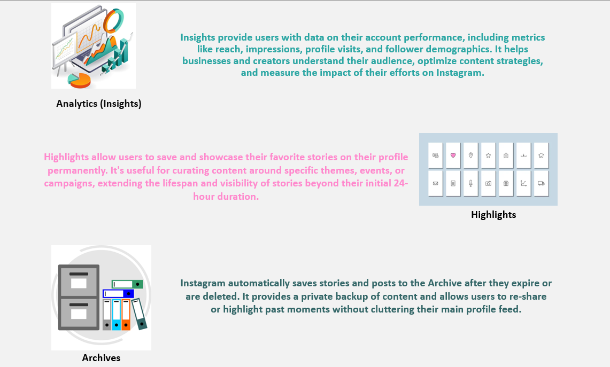
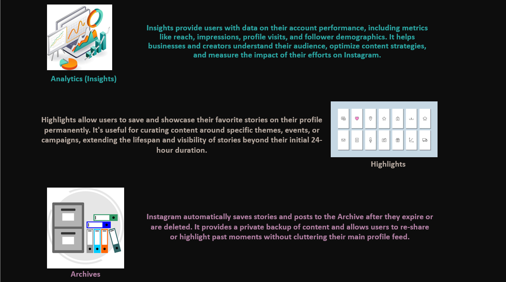

### Name 
**Anushika Kothari** 🧑‍🎓
### USN
**01FE21BCS062**🏫

### Course Name
**Arithmetic Program Solving** 📊

### Course Code
**23ECSE309** 🔢

### Course Teacher
**Prof. Prakash Hegade** 👨‍🏫

### University
**KLE Technological University, Hubballi-31** 🏛️

### Portfolio Domain
**Instagram** 📸
----

### 🌟 **Introduction**

Welcome to my portfolio, where I delve into the realm of arithmetic problem-solving within Instagram. As one of the world's largest social media platforms, Instagram provides a dynamic environment 🌍 ripe for tackling complex challenges using innovative programming techniques. Its vast user engagement, diverse content generation 📸, and sophisticated algorithms offer a fertile ground for exploring new solutions.

I'm captivated by Instagram's ever-evolving landscape, which continually presents fresh opportunities for algorithmic optimization. Drawing from established methodologies, my goal is to pioneer novel approaches tailored to Instagram's unique challenges. With its global reach and profound impact across various domains 🌐, Instagram stands as a cornerstone of modern social media.

In this portfolio, I explore how arithmetic problem-solving can enhance user experiences within Instagram's intricate ecosystem. 🧠💡

## 📊 Business Cases in Instagram

### Influencer Marketing

Many businesses collaborate with influencers on Instagram to promote their products or services. This involves analyzing influencer engagement rates, audience demographics, and campaign performance metrics.

### Content Marketing

Businesses use Instagram to share visually appealing content such as images, videos, and stories to engage with their audience. They track metrics like likes, comments, shares, and reach to measure content effectiveness.

### E-Commerce Instagram

Some businesses sell products directly through Instagram by setting up a shoppable feed or using features like Instagram Shopping. This involves managing product catalogs, inventory, and tracking sales conversions.

### Brand Awareness Campaigns

Companies run brand awareness campaigns on Instagram to increase visibility and reach new audiences. This involves creating compelling visual content and tracking metrics like impressions, reach, and brand mentions.

### Customer Engagement and Support

Businesses use Instagram to interact with customers, answer queries, and provide support. This involves monitoring direct messages, comments, and mentions to ensure timely responses and maintain a positive brand image.

### User-Generated Content (UGC) Campaigns

Brands encourage users to create and share content related to their products or services. This involves incentivizing user participation, curating UGC, and tracking campaign engagement.

### Market Research and Consumer Insights

Companies analyze data from Instagram to gain insights into consumer preferences, trends, and behavior. This involves monitoring hashtags, trends, and competitor activities to inform strategic decision-making.

### Event Promotion

Businesses promote events such as product launches, conferences, or store openings on Instagram. This involves creating event-specific content, leveraging Instagram Stories and Live features, and measuring event awareness and attendance.

### Employee Advocacy

Some businesses involve employees in their Instagram marketing efforts by encouraging them to share company-related content. This involves providing guidelines, tracking employee engagement, and measuring the impact on brand visibility.

### Collaborations and Partnerships

Brands collaborate with other businesses, influencers, or organizations on Instagram to reach new audiences and enhance brand credibility. This involves identifying suitable partners, negotiating terms, and tracking the success of collaborations.

## 💡 Design Challenges
### Content Recommendation
Content recommendation presents a formidable design challenge for Instagram due to its vast and dynamic content pool, diverse user base, and the need to balance personalization with diversity while ensuring fairness, engagement, and user trust. The platform must develop algorithms that adapt to evolving user preferences, promote serendipitous discovery, mitigate bias, and prioritize user privacy, all while delivering a seamless and engaging experience tailored to each individual user.

### To-Do
Dynamic programming can be applied in the content-based filtering aspect of content recommendation.

In content-based filtering, the system recommends content to users based on the attributes and features of the items they have interacted with or shown interest in. Dynamic programming algorithms, such as Longest Common Subsequence (LCS), can be used to compare the features of different posts, such as image content, captions, hashtags, and engagement metrics.

For example, LCS can be applied to compare the textual content of captions or descriptions of posts to identify similarities between them. This similarity measure can then be used to recommend posts with similar content themes or features to users who have shown interest in related content. Dynamic programming helps efficiently compute these similarities, enabling more accurate and personalized content recommendations.

**Code for sample implementation of [Longest Common Subsequence](all_codes/Longest-Common-Subsequence.cpp)**

---

## 📚 References
- [Instagram Official Site](https://www.instagram.com)
- [Dynamic Programming Techniques](https://en.wikipedia.org/wiki/Dynamic_programming)
