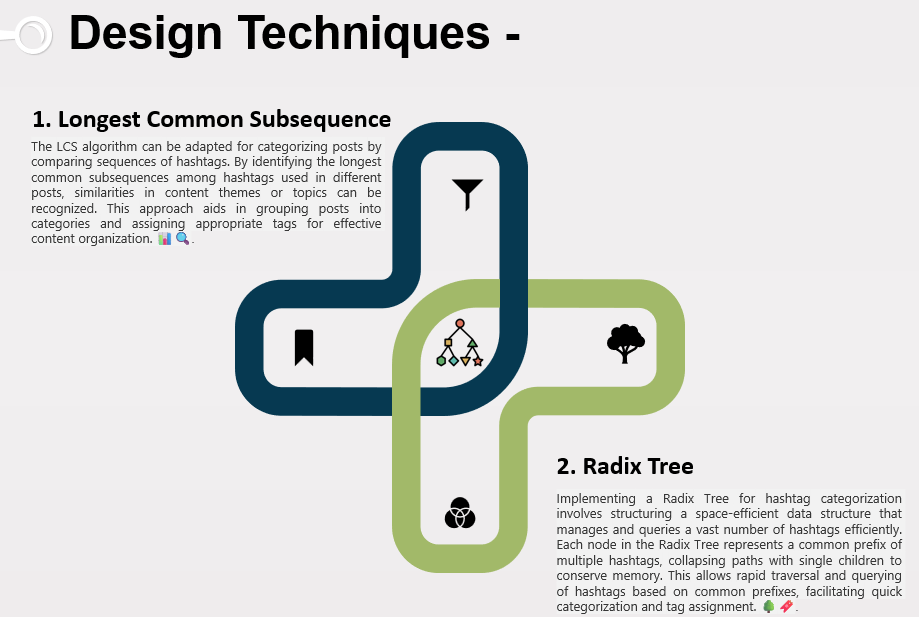

### Name 
**Anushika Kothari** 🧑‍🎓
### USN
**01FE21BCS062**🏫

### Course Name
**Arithmetic Program Solving** 📊

### Course Code
**23ECSE309** 🔢

### Course Teacher
**Prof. Prakash Hegade** 👨‍🏫

### University
**KLE Technological University, Hubballi-31** 🏛️

### Portfolio Domain
**Instagram** 📸
----

### 🌟 **Introduction**
Welcome to my portfolio, where I delve into the realm of arithmetic problem-solving within Instagram. As one of the world's largest social media platforms, Instagram provides a dynamic environment 🌍 ripe for tackling complex challenges using innovative programming techniques. Its vast user engagement, diverse content generation 📸, and sophisticated algorithms offer a fertile ground for exploring new solutions.

I'm captivated by Instagram's ever-evolving landscape, which continually presents fresh opportunities for algorithmic optimization. Drawing from established methodologies, my goal is to pioneer novel approaches tailored to Instagram's unique challenges. With its global reach and profound impact across various domains 🌐, Instagram stands as a cornerstone of modern social media.

In this portfolio, I explore how arithmetic problem-solving can enhance user experiences within Instagram's intricate ecosystem. 🧠💡

## 📊 Services Provided by Instagram

## 💡 Design Challenges & Solutions 
### 1. Posts Categorization Based on Hashtags 🔖

**Challenges and Market Benefits**:
Categorizing posts based on hashtags on platforms like Instagram enhances content discoverability and improves user engagement. However, the challenges include handling vast amounts of user-generated content, ensuring accurate categorization to provide relevant recommendations, and adapting to the dynamic nature of trending hashtags. 📈💬

**Shortcomings and Scalability Issues with LCS:**

* **Time Complexity:** O(m * n), where m and n are the lengths of the hashtag sequences. While suitable for moderate datasets, the quadratic time complexity can become impractical for large-scale applications without optimization. ⏳
* **Semantic Understanding:** LCS may not capture the full semantic meaning or context of hashtags, limiting its ability to categorize based on nuanced topics or trends effectively. 🤔
* **Scalability:** Optimization or parallelization is necessary to handle the extensive volume of posts and hashtags generated on platforms like Instagram. 📈

*Code for sample implementation of [Longest Common Subsequence](all_codes/Longest-Common-Subsequence.cpp)*

**Shortcomings and Scalability Issues with Radix Tree:**

* **Time Complexity:** Insertion, deletion, and search operations are O(l), where l is the length of the tag. This efficiency is suitable for handling real-time hashtag updates and dynamic content categorization. ⚡
* **Space Complexity:** O(n * l), where n is the number of hashtags and l is the average length of hashtags. While generally efficient, the space overhead may become significant with a massive number of distinct hashtags. 🧠
* **Maintenance in Distributed Systems:** Synchronization challenges may arise when maintaining Radix Trees across distributed systems, requiring careful management to ensure consistency and efficiency. 🌐

*Code for sample implementation of [Radix Tree](https://github.com/Anushika0304/radix-tree/blob/master/radix_tree.cpp)*

By leveraging these design techniques, Instagram can effectively categorize posts based on hashtags, enhancing content discoverability, improving user engagement through personalized recommendations, and maintaining a scalable infrastructure to handle the platform's dynamic nature. Each approach offers unique advantages and challenges, depending on the specific requirements and scale of hashtag analysis on social media platforms.

---

### 2. Hashtag Suggestions Using Edit Distance 🔖

**Challenges and Market Benefits**:
Ensuring accuracy and relevance in hashtag suggestions is critical. The system must process user input in real-time without noticeable delays 🕒, handle a large and growing database of hashtags efficiently, and support multiple languages and slang 🌐. Additionally, it needs to dynamically update the database with new trends while maintaining performance 📈.

**Design Technique**:
Maintain a database of popular hashtags using a trie 🌳 or BK-tree for efficient management. When a user types a hashtag, calculate the edit distance between the input and stored hashtags to find the closest matches. Suggest hashtags with the smallest edit distances, using approximate string matching 🔍 and parallel processing to optimize performance.

**Shortcomings & Scalability**:
The edit distance algorithm can be computationally intensive with a time complexity of O(m * n) 🧮, leading to high memory usage. Using tries or BK-trees helps manage large datasets and reduces search time ⏳. The time complexity for operations in a trie is O(l) where l is the length of the hashtag, and the space complexity is O(n * l), where n is the number of hashtags. Parallel processing and load balancing ensure optimal resource utilization ⚖️. Implementing incremental updates allows the system to handle new and outdated hashtags without requiring a complete rebuild, maintaining responsiveness and efficiency 🚀.

*Code for sample implementation of [Edit Distance](all_codes/edit.cpp)*

*Code for sample implementation of [Trie](all_codes/trie.cpp)*

---
### 3. Real-Time Analytics and Insights 📊
**Challenges and Market Benefits:**
Efficiently managing and querying large datasets in real-time poses significant challenges for Instagram. The platform must handle vast amounts of data generated by user interactions, including likes, comments, shares, and hashtag usage. Ensuring low latency and high accuracy in analytics is critical to provide timely insights. The market benefits include improved user engagement, personalized content delivery, and enhanced advertising strategies based on accurate and up-to-date analytics.

**Design Technique**
Employing a segment trees for efficient real-time analytics. Each node in the segment tree represents aggregated metrics (e.g., sum, max, min) over data points. Leaf nodes store individual user interactions, while internal nodes maintain aggregated values. Updates propagate from leaf to root, ensuring accuracy for range queries and updates.

**Time and Space Complexity:**
Construction: O(n) for tree setup from data points.
Queries: O(log n) for efficient metric retrieval.
Updates: O(log n) for propagating changes.
Space: O(n) for node storage, manageable with proper resource allocation.

**Shortcomings & Scalability:**
* **Shortcomings**: Segment trees have O(n) space complexity, taxing memory with large datasets. Frequent updates, common in real-time streams, can be costly. Maintaining consistency across distributed environments poses challenges.
* **Scalability**: Horizontal scaling via distributed segment trees balances load across servers. Sharding divides data for efficiency. Parallel processing and map-reduce enhance query handling. Dynamic updates optimize performance.

*Code for sample implementation of [Segment Tree](all_codes/segment.cpp)*

### 4. Personalized Content Recommendations 🔍✨
**Challenges and Market Benefits:**
Personalizing content on Instagram involves navigating a vast network of user interests and interactions. The challenge is to efficiently find relevant content in real-time ⏱️. Effective personalization boosts user engagement and satisfaction 📈.

**Design Technique:**
A* search can find the shortest path to relevant content. Users and content items are nodes in a graph, with edges representing preferences and interactions. A* uses a heuristic to prioritize paths, efficiently recommending content that matches user interests.

**Time and Space Complexity:**

Time Complexity: O(b^d) 🌐

Space Complexity: O(b^d) 📊
, where **b** is branching factor and **d** is depth of the solution 

**Shortcomings & Scalability:**
A* relies on the heuristic's accuracy, and designing an effective heuristic can be challenging. Real-time computation may be resource-intensive, especially with a large and complex user-content graph. However, parallel processing and distributed computing can scale A* search for a large user base. Partitioning the graph and distributing the search process ensures efficiency, while caching and pre-computing paths reduce computational load, maintaining responsiveness and effectiveness 🚀.

### 5. Ad Placement Optimization on Instagram 📏
**Challenges and Market Benefits:**
Instagram faces challenges in optimizing ad placements, much like the Rod Cutting Problem, by balancing optimal ad durations for user engagement without overwhelming users. This involves analyzing user interaction patterns to adjust ad lengths effectively. Balancing revenue goals with a positive user experience is critical, ensuring ads are relevant and non-intrusive to enhance user satisfaction. By strategically optimizing ad placements, Instagram can maximize revenue and improve user engagement, fostering higher retention rates and loyalty among users.🕒📈

**Design Technique:**
The Rod Cutting Problem can be analogously applied to optimize ad placements on Instagram. Just as the rod cutting problem seeks to maximize the profit from cutting a rod into pieces of various lengths, Instagram can maximize revenue by determining the best placement and duration for ads based on user behavior and engagement metrics. 📏💼

**Complexity:**
Time Complexity: O(n^2) using dynamic programming, where n is the number of different ad placement lengths.
Space Complexity: O(n), where n is the number of different ad placement lengths.🧮

**Shortcomings and Scalability**:
Using the Rod Cutting Problem for ad optimization on Instagram faces challenges in accurately matching ad placements with dynamic user behaviors and context. It aims to maximize revenue by finding the best ad durations but may miss subtle contextual cues crucial for user engagement. Scalability issues arise from managing large datasets and ensuring algorithms can adapt quickly, requiring robust infrastructure and adaptive learning. Overcoming these challenges involves refining algorithms and leveraging real-time data insights to improve ad effectiveness and user satisfaction on the platform.🚀

*Code for sample implementation of [Rod Cutting Problem](all_codes/rod.cpp)*

---
### 6. Efficient managing and retrieving of user timelines
**Challenges & Market Benefits**:
Implementing skip lists in Instagram for managing user timelines or feeds presents challenges in terms of space complexity, implementation intricacies, and performance optimization. However, skip lists offer significant benefits such as efficient access with logarithmic time complexity for operations, scalability to handle large-scale data dynamically, and improved user experience through faster content delivery and enhanced engagement on the platform. Achieving these benefits requires careful design and maintenance to balance performance requirements with storage costs and operational complexities.

**Design Technique:**
Implementing skip lists involves maintaining multiple layers of linked lists with probabilistic skipping, which speeds up search operations. Each level acts as an express lane, reducing the average time complexity for search operations.

**Complexity:** 
Time Complexity : Skip lists offer efficient average-case time complexities for search, insertion, and deletion operations, all being O(log n), where n is the number of elements in the list.

Space Complexity : The space complexity of skip lists is O(n).

**Shortcomings and Scalability:** Skip lists require more memory compared to basic data structures due to their additional layers, which can limit their efficiency in memory-constrained environments. While they dynamically adjust to changes in data size and access patterns, their implementation complexity can pose challenges in distributed systems, requiring careful synchronization to maintain consistency and scalability. Despite their efficiency in average cases, skip lists may not be optimal for applications demanding strictly minimized memory usage or ultra-fast operations beyond logarithmic time complexity.

*Code for sample implementation of [Skip List](all_codes/skip.cpp)*

## 📚 References
- [Instagram Official Site](https://www.instagram.com)
- [Dynamic Programming Techniques](https://en.wikipedia.org/wiki/Dynamic_programming)
